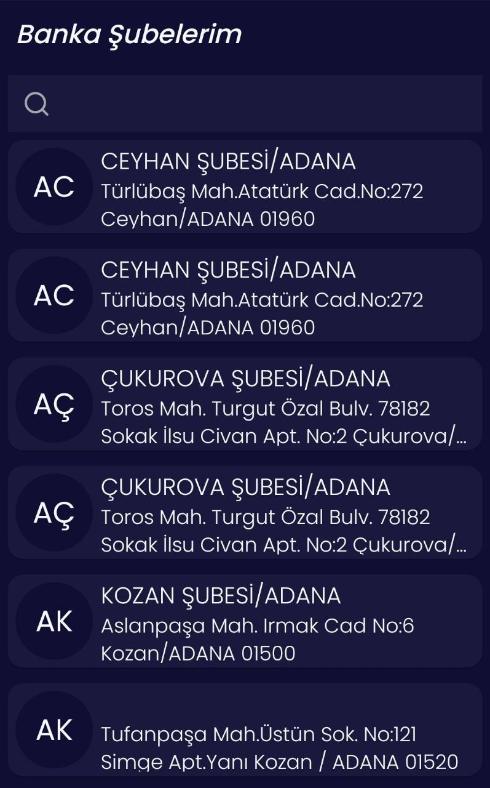
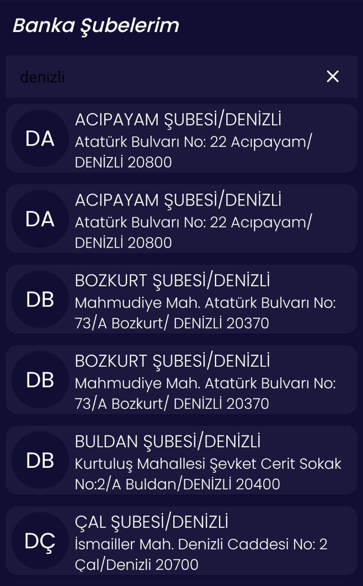
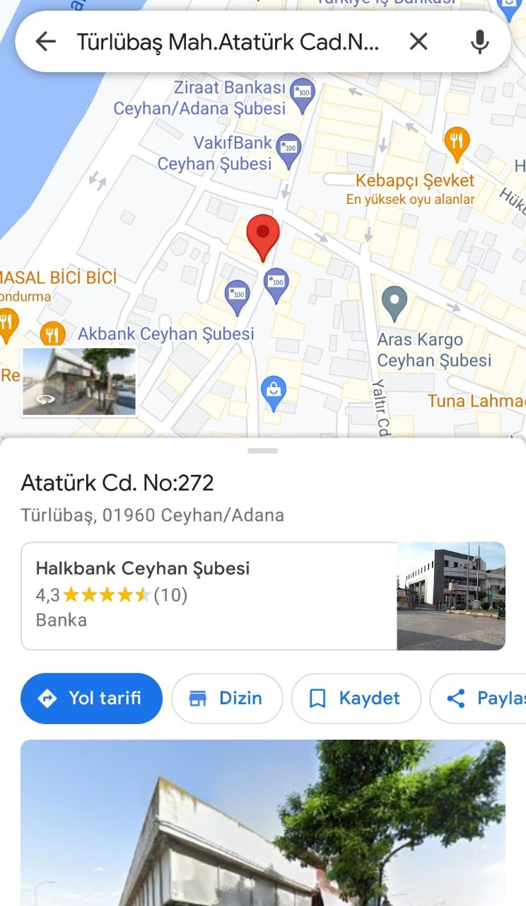

# Banka-Subeleri

<p float="left">
  
    
  
  
  
  
  
  
</p>

## Kütüphaneler
1. Retrofit (Rest istemci kütüphanesi)
2. Gson (Json class converter)
3. Sdp ve Ssp (Farklı ekran çözünürleri için standart bir tasarım oluşturmak için kullanılır.)
4. Lottie (Animasyon kütüphanesi)
5. SpinKit (Progress kütüphanesi)
6. Jetpack Navigation Component (Fragment )
7. Firebase Crashlytics (Hata tesbiti için)
8. Firebase Analytics 
9. Material Component
10. Swipe Refresh Layout (Data güncelleme için)

- Mvvm Mimarisi
- Data Binding
- Live Data


## Anasayfa
- [x] Bu sayfa açıldığında ekranın ortasında bir loading process gösterilmeli ve aşağıda belirtilen 
api’ye istenilen servis çağrıları yapılmalıdır
- [x] Gelen sonuç listelenmeli. Eğer data yoksa kullanıcıya uyarı verilmeli. 
- [x] Sayfada şehir adına göre arama özelliği olmalı. Şube listesi arama sonucuna göre 
güncellenmeli.
- [x] İnternet bağlantı kontrolü olmalı. İnternet bağlantısı yoksa kullanıcıya uyarı verilmeli.


## Şube detay ekranı Listelenen şubelerden birine tıklandığında açılacak sayfadır
- [x] . Bu sayfada şube detayları gösterilmelidir. 
- [x] Firebase analytics Şube detay ekranı açıldığında şube detayları Firebase analytics kullanılarak 
loglanmalıdır.
- [x] Kullanıcı yol tarifi butonuna basınca navigasyona yönlendirip, kullanıcıya yol 
tarifi vermelidir.
- [x] MVVM kullanımı tercih sebebidir. 
- [x] Sayfalar arası Geçiş animasyonları

### Gradle Dosyası
```java

    //Material Design
    implementation 'com.google.android.material:material:1.6.1'

    //Navigation Component
    implementation 'androidx.navigation:navigation-fragment:2.5.0'
    implementation 'androidx.navigation:navigation-ui:2.5.0'
    //Firebase 
    implementation 'com.google.firebase:firebase-analytics:17.2.2'
    implementation 'com.google.firebase:firebase-crashlytics:18.2.11'

//Scalable size unit
    implementation 'com.intuit.ssp:ssp-android:1.1.0'
    implementation 'com.intuit.sdp:sdp-android:1.1.0'

    //Lottie Library
    implementation 'com.airbnb.android:lottie:5.2.0'

    //SpinKit Library
    implementation 'com.github.ybq:Android-SpinKit:1.4.0'

    //Retrofit Library
    implementation 'com.squareup.retrofit2:retrofit:2.9.0'
    implementation 'com.squareup.retrofit2:converter-gson:2.9.0'

    
    //SwipeRefresh Layout
    implementation "androidx.swiperefreshlayout:swiperefreshlayout:1.1.0"

```


